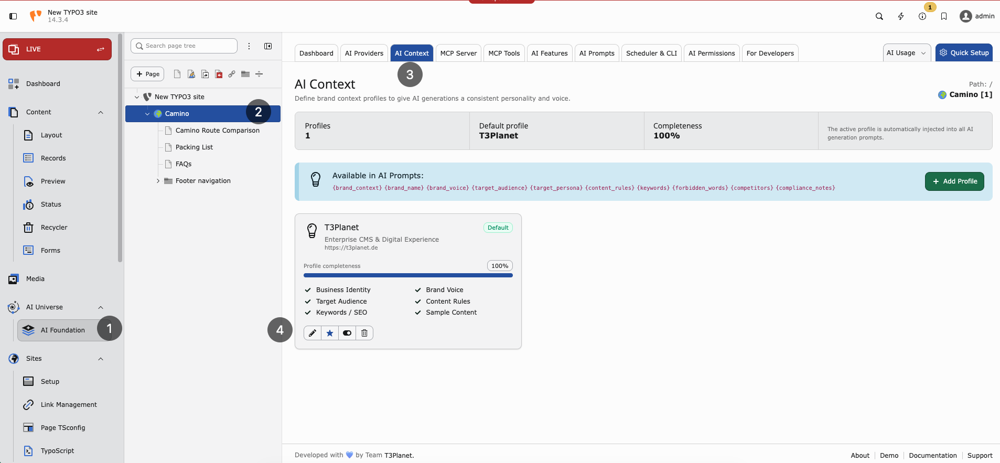
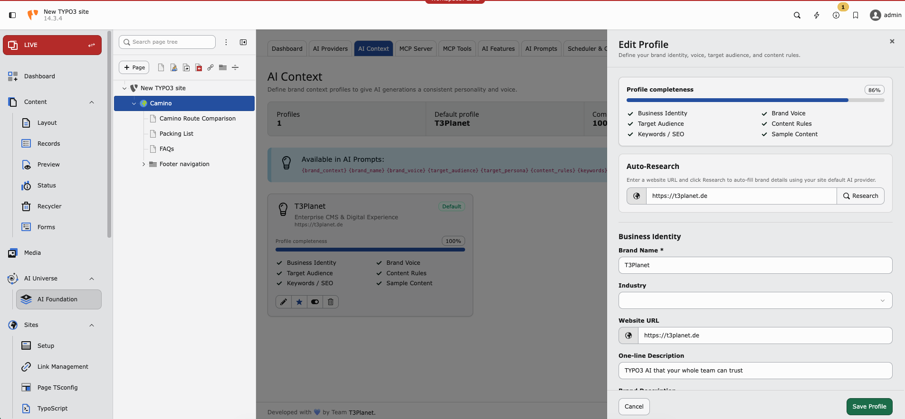

.. include:: ../../Includes.txt

.. _ai-context:

==========
AI Context
==========

Purpose
-------

Store your **brand profile** once. AI Foundation injects it into prompts for consistent, on-brand results across all connected extensions.

**Path:** :guilabel:`AI Foundation > AI Context`

`AI Foundation AI Context Demo <https://app.supademo.com/embed/cmrbp3jz80eaiqmo5zuj6gb0e?utm_source=link>`__

   AI Context — brand profiles, completeness, and prompt variables.

What to store
-------------

* **Company name** — For example Finance Company GmbH
* **Industry** — For example financial services
* **Audience** — For example SME owners in Germany
* **Brand voice** — Professional, clear, trustworthy
* **Key messages** — Digital-first, personal service
* **SEO keywords** — finance, banking, loans
* **Language style** — German formal (Sie) or simple English

Why it matters
--------------

Without context, AI output sounds generic. With context, text matches your brand and market. Every editor benefits without retyping instructions.

Setup (3 steps)
---------------

1. Open :guilabel:`AI Foundation > AI Context`
2. Fill business identity fields
3. Save — extensions use it automatically on the next AI request

   Edit profile — auto-research and business identity fields.

When to update AI Context
-------------------------

* Rebrand or new product line
* New target market (for example expand from DE to EN)
* Compliance change (formal Sie required everywhere)
* After :ref:`AI Prompts <ai-prompts>` changes still produce off-brand text

Scenario: multi-language site
-----------------------------

Set language style to “German formal (Sie) for DE; simple English for EN”. Add brand terms that must stay untranslated. Connected translation features will respect this context.

See also :ref:`AI Prompts <ai-prompts>` for task-specific instructions.
