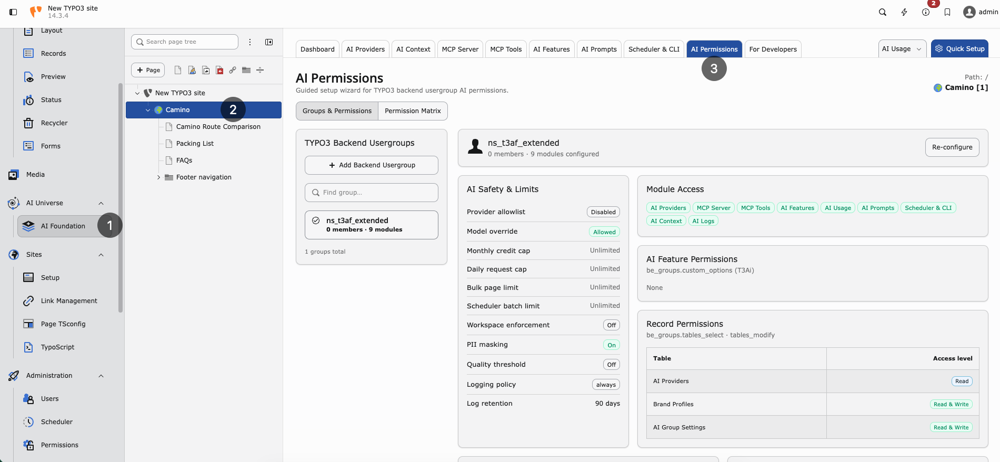

.. include:: ../../Includes.txt

.. _ai-permissions:

==============
AI Permissions
==============

Guided setup wizard for TYPO3 backend usergroup AI permissions.

**Path:** :guilabel:`AI Foundation > AI Permissions`

`AI Foundation AI Permissions Demo <https://app.supademo.com/embed/cmrbpvc5y0g0vqmo5l30iq6mc?utm_source=link>`__

   AI Permissions — configure backend usergroups and review the cross-group
   Permission Matrix.

Only **TYPO3 administrators** can open and change this module. Runtime
enforcement still applies to every backend user.

Purpose
=======

Role-based access and permissions for AI on TYPO3: a guided wizard over
backend usergroups so junior staff, clients, and freelancers get safe AI
access without seeing admin-only tools.

Configure per group:

* **Module access** — Which AI Foundation tabs and child modules appear
* **Fine-grained feature permissions** — Which features inside those modules
  are allowed
* **Record-level restrictions** — Read vs read/write on providers, prompts,
  context profiles, logs, and other catalog records
* **Page-scope and batch limits** — Bulk page limits, scheduler batch limits,
  and workspace enforcement where enabled
* **Per-group credit limits** — Monthly credit caps and daily request caps

The module writes into normal TYPO3 backend user group ACL fields
(``groupMods``, ``custom_options``, ``tables_select``, ``tables_modify``) and
merges only AI-managed keys. Unrelated modules and tables already granted to
the group stay intact.

TYPO3 Backend Usergroups
========================

The left sidebar lists backend user groups (same shell pattern as MCP Tools).

* Search with :guilabel:`Find group…`
* Each row shows the group name, member count, and how many AI modules are
  configured
* Select a group to open the guided wizard for that group

Example: a group such as ``ns_t3af_extended`` may show ``0 members`` and a
configured module count after you apply permissions.

Guided wizard
=============

After you select a group, the wizard walks through five steps:

1. **Modules** — Toggle AI Foundation admin modules and installed child
   extensions (for example AI Assistant, AI Search Hub, and other registered
   suite modules).
2. **Features** — Grant fine-grained feature permissions for the modules you
   enabled.
3. **Records** — Set record-level read or read/write access for catalog
   records those modules manage.
4. **Limits** — Set per-group credit limits, daily request caps, bulk/page
   batch limits, workspace enforcement, and audit/logging options (shown in
   the matrix under Credits, Workspace, and Audit).
5. **Review** — Preview the merged ``be_groups`` values, then apply.

Use :guilabel:`Back` / :guilabel:`Next` in the wizard footer. On Review, confirm
the preview, then apply and flush caches before testing with an editor account.

Permission Matrix
=================

Open the **Permission Matrix** tab for a cross-group overview. The subtitle
shows how many groups exist and how many are configured (for example
``1 groups, 1 configured``).

Legend
------

* **Use / Read / On** — Allowed (green check)
* **Mgr** — Manage / read+write
* **—** — No access

AI Foundation columns
---------------------

Typical matrix columns for AI Foundation:

* Group name and member count
* Admin modules: :guilabel:`AI Providers`, :guilabel:`MCP Server`,
  :guilabel:`MCP Tools`, :guilabel:`AI Features`, :guilabel:`AI Usage`,
  :guilabel:`AI Prompts`, :guilabel:`Scheduler & CLI`, :guilabel:`AI Context`,
  :guilabel:`AI Logs`
* AI Safety / limits: Credits, Workspace, Audit

Child extension scope tabs appear when those extensions register an access
catalog. Unconfigured groups stay dimmed with a **Not configured** badge.

What enforcement does
=====================

After you apply permissions:

* Restricted editors only see AI Foundation tabs they are allowed to use
* Dashboard may show an allowed-tabs overview instead of full analytics when
  usage/context/MCP tabs are closed
* :guilabel:`AI Providers` create/edit/delete needs write access on the
  provider table; otherwise the list stays read-only (Test connection can still
  work)
* Child extension tabs, cards, and mutating routes follow the same grants
  (403 when write is denied)

Administrators always keep full access to configure AI Permissions.

Recommended workflow
====================

1. Create or choose a backend user group for editors.
2. Open :guilabel:`AI Foundation > AI Permissions`.
3. Select the group and complete Modules → Features → Records → Limits →
   Review.
4. Check the **Permission Matrix** for that group.
5. Flush caches.
6. Log in as a user in that group and confirm hidden tabs and read-only
   screens match the matrix.

When to use this module
=======================

* Safe AI access for junior staff, clients, and freelancers
* Editors share one instance across departments
* MCP or provider management must stay admin-only
* Per-group credit or request caps are required
* Child extensions must show only allowed tabs, features, and write actions

Developer extensions can register additional modules, features, and records
through :ref:`Custom Access Catalogs <custom-ai-access>`.

Product overview: `AI Foundation on GitHub <https://github.com/nitsan-technologies/ns_t3af>`__.