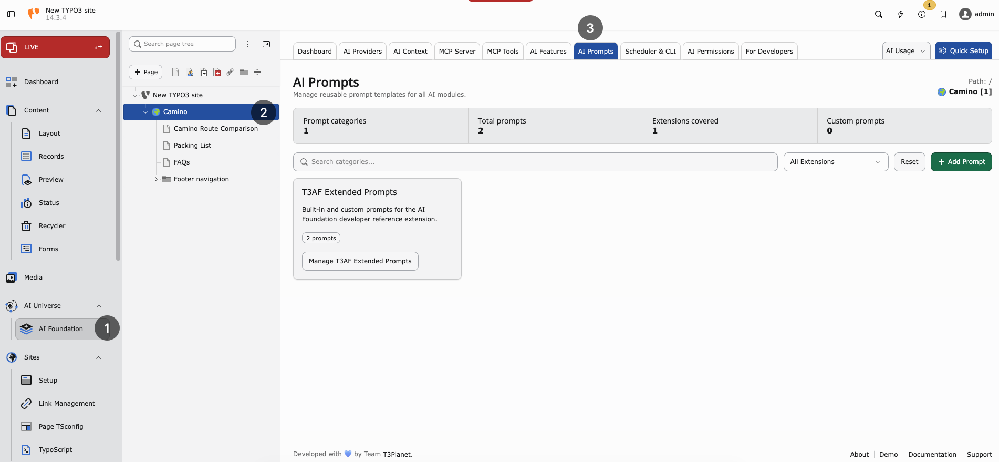

.. include:: ../../Includes.txt

.. _ai-prompts:

==========
AI Prompts
==========

Purpose
-------

Central **prompt templates** for AI Foundation and connected extensions. Same prompt quality for every user and every extension.

**Path:** :guilabel:`AI Foundation > AI Prompts`

   AI Prompts — prompt categories contributed by connected extensions.

.. note::

   Use **AI Prompts** only when at least one child extension is installed
   and that extension provides prompt-based AI functionality. Examples:

   * `AI Assistant <https://t3planet.de/t3ai-typo3-erweiterung>`__
   * `AI Chatbot <https://t3planet.de/t3ac-typo3-erweiterung>`__
   * `AI Search <https://t3planet.de/t3as-typo3-erweiterung>`__
   * `AI Accessibility <https://t3planet.de/t3aa-typo3-erweiterung>`__

   AI Foundation stores the shared prompt templates. The child extension
   loads and uses them at runtime. If no prompt-enabled child extension is
   installed, this module has little practical effect.

What is a prompt?
-----------------

The instruction sent to the AI. Examples:

* “Write a meta description, max 155 characters”
* “Translate to German, formal Sie”

Central prompts mean **consistent quality** across your team.

Manage prompts
--------------

1. Open AI Prompts
2. Select feature category
3. Edit template text
4. Save and test with one real request

Extensions can sync default prompts from AI Foundation.

Writing good prompts
--------------------

1. **Be specific** — length, format, language
2. **Set tone** — formal, friendly, technical
3. **Say what to avoid** — no emojis, no hype, no legal claims
4. **Include the page goal** — SEO, translation, rewriting, or summary

Example prompt
--------------

.. code-block:: none

   Write a friendly greeting for [audience] mentioning [topic].

Pair prompts with :ref:`AI Context <ai-context>` for brand voice. Context handles who you are; prompts handle what to do.

Reset to default
----------------

If results worsen after edits, use **Reset to default** in the UI. Then change one variable at a time and test again.

When to customize prompts
-------------------------

* SEO team has strict meta description rules
* Legal requires disclaimers in generated text
* German formal (Sie) must appear in every output
* Extension default is too generic for your industry

When to leave defaults
----------------------

* Small team still learning AI features
* You have not yet filled :ref:`AI Context <ai-context>`
* Results are already good — do not over-edit

Governance note
---------------

Prompt changes affect all users. Coordinate with :ref:`AI Permissions <ai-permissions>` before large template changes on production.
