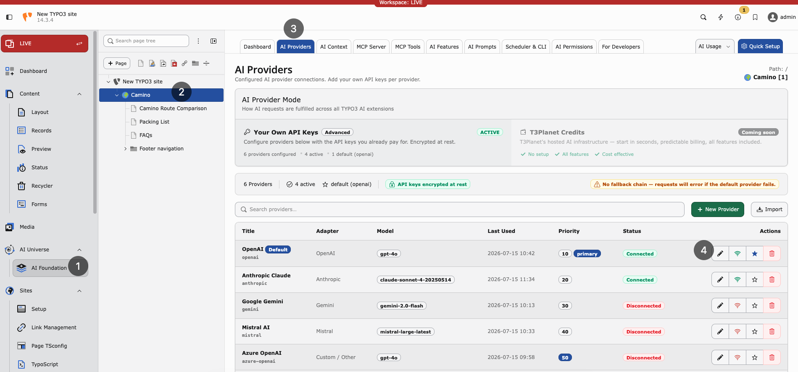
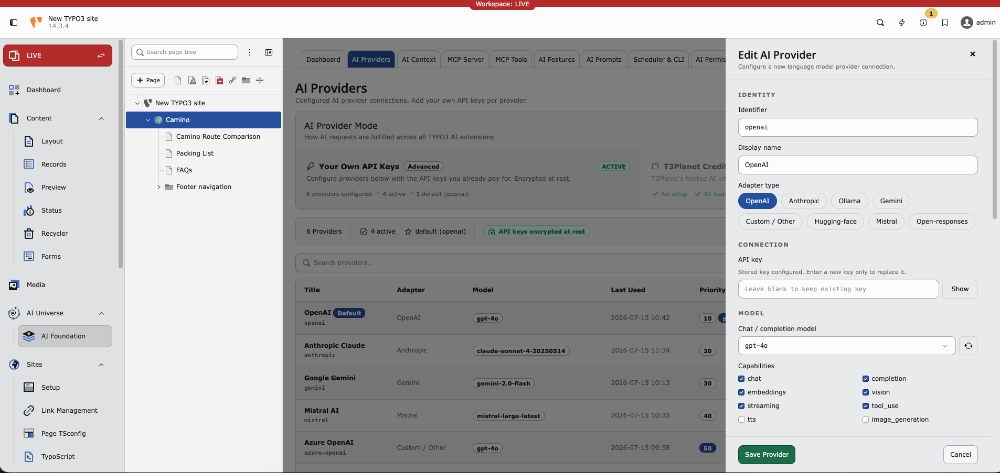

.. include:: ../../Includes.txt

.. _ai-providers:
.. _provider-fields:

============
AI Providers
============

Providers represent connections to AI services. Each provider stores an adapter
type, optional endpoint, encrypted credentials, models, and capability flags.

**Path:** :guilabel:`AI Foundation > AI Providers`

`AI Foundation Providers Demo <https://app.supademo.com/embed/cmrbo0w7i0d96qmo57ifnabvz?utm_source=link>`__

   AI Providers list — configured adapters, models, connection status, and
   default provider.

Without at least one working provider, no AI feature runs.

Adding a provider
=================

1. Open :guilabel:`AI Foundation > AI Providers`.
2. Click :guilabel:`Add provider`.
3. Fill in the required fields:

   * **Display name** — Friendly label for your team (for example ``OpenAI
     production``).
   * **Adapter type** — Vendor protocol (OpenAI, Anthropic, Gemini, Azure,
     Mistral, DeepSeek, xAI, Ollama, or custom OpenAI-compatible).
   * **API key** — Cloud vendors need a key. Leave empty for local Ollama.
   * **Model ID** — Completion model (for example ``gpt-4o-mini``).

4. Optionally set the endpoint URL, embedding model, capabilities, temperature,
   and pricing fields.
5. Click :guilabel:`Save`.
6. Enable :guilabel:`Default` on exactly one provider.

.. tip::

   For first-time setup, use :guilabel:`Quick Setup` in the AI Foundation module
   header. It walks through provider creation with fewer decisions.

   Edit AI Provider — adapter type, API key, chat model, and capability flags.

Testing a connection
====================

After saving a provider, click :guilabel:`Test connection` to verify the setup.
The test calls the provider API and reports:

* Connection status (success or failure)
* Error details on failure
* Model / capability hints when the adapter can list them

.. note::

   Self-hosted endpoints (such as Ollama) must be reachable from the TYPO3
   server. Typical causes of a failed test:

   * Wrong host or port in :guilabel:`Endpoint URL` (default
     ``http://localhost:11434`` for Ollama)
   * Docker/network isolation between PHP and the model host
   * Outbound HTTPS blocked for cloud vendors

   Local adapters usually do not need an API key. Cloud adapters do.

If your server reaches the internet only through a corporate proxy, configure
TYPO3 HTTP settings:

..  code-block:: php
    :caption: config/system/additional.php

    $GLOBALS['TYPO3_CONF_VARS']['HTTP']['proxy'] = 'http://proxy.example.com:8080';

Editing and deleting providers
==============================

* Click a provider row to edit its settings in the drawer.
* Use :guilabel:`Test connection` after rotating an API key or changing the
  model.
* Use :guilabel:`Delete` to remove a provider. Features that pointed at that
  provider fall back to the global default (or fail until another provider is
  assigned).

.. warning::

   Deleting the only default provider leaves child extensions without a global
   fallback. Set another provider as :guilabel:`Default` first.

Supported adapters
==================

Built-in and discovered adapters include:

* ``symfony.openai`` — OpenAI
* ``symfony.anthropic`` — Anthropic Claude
* ``symfony.gemini`` — Google Gemini
* ``symfony.mistral`` — Mistral AI
* ``symfony.ollama`` — Local Ollama
* ``symfony.openrouter`` — OpenRouter
* ``nst3af.openai_compatible`` — Custom / OpenAI-compatible endpoints
* Additional Symfony AI bridges when their Composer packages are installed
  (for example Azure, DeepSeek, xAI)

Custom adapters: :ref:`Custom AI Providers <custom-ai-providers>`.

Capabilities
============

Pick a model that supports what you need. :guilabel:`Test connection` helps
validate the choice.

* **Chat** — Text generation
* **Streaming** — Live response display in the backend
* **Embeddings** — Search and similarity features
* **Vision** — Image analysis
* **Tool use** — MCP agent workflows

Multiple providers — when and why
=================================

**Dev and live** — Separate rows with different API keys per environment.

**Cost saving** — Cheap model as global default; premium model assigned in
:ref:`AI Features <ai-features>` for important tasks.

**EU hosting** — Mistral or Azure in an EU region for data residency
requirements.

Provider fields
===============

Fields below map to the :guilabel:`AI Providers` drawer and the
``tx_nst3af_provider`` table.

Required
--------

..  confval:: identifier
    :name: provider-identifier
    :required: true
    :type: string

    Unique slug for programmatic access (for example ``openai-prod``,
    ``ollama-local``). Must be unique.

..  confval:: title
    :name: provider-title
    :required: true
    :type: string

    Display name shown in the backend and dropdowns.

..  confval:: adapter_type
    :name: provider-adapter-type
    :required: true
    :type: string

    Adapter protocol identifier, for example ``symfony.openai`` or
    ``nst3af.openai_compatible``.

Connection
----------

..  confval:: api_key
    :name: provider-api-key
    :type: string

    API key for authentication. Stored as sodium ciphertext with an
    ``enc:v1:`` prefix — raw keys are never kept in the database. Required for
    cloud adapters; usually empty for local Ollama.

..  confval:: endpoint_url
    :name: provider-endpoint-url
    :type: string
    :default: Adapter default

    Custom API base URL. Required for OpenAI-compatible and Ollama-style
    adapters when the default host is wrong for your network.

..  confval:: model_id
    :name: provider-model-id
    :type: string

    Default completion / chat model ID.

..  confval:: embedding_model_id
    :name: provider-embedding-model-id
    :type: string

    Default embedding model ID when embeddings are enabled.

Optional configuration
----------------------

..  confval:: capabilities
    :name: provider-capabilities
    :type: string list

    Enabled capabilities: ``chat``, ``completion``, ``embeddings``, ``vision``,
    ``streaming``, ``tool_use``.

..  confval:: temperature
    :name: provider-temperature
    :type: float
    :default: ``0.7``

    Default sampling temperature (``0.0``–``2.0``).

..  confval:: system_prompt
    :name: provider-system-prompt
    :type: text

    Optional provider-level system message prepended to requests.

..  confval:: is_default
    :name: provider-is-default
    :type: bool
    :default: ``false``

    Mark as the global default. Keep exactly one default among enabled rows.

..  confval:: is_enabled
    :name: provider-is-enabled
    :type: bool
    :default: ``true``

    Soft on/off switch without deleting the row.

..  confval:: priority
    :name: provider-priority
    :type: integer
    :default: ``50``

    Ordering hint (``0``–``100``) when multiple providers are listed.

..  confval:: be_groups
    :name: provider-be-groups
    :type: backend groups

    Restrict this provider to selected backend groups. Empty means available to
    all groups.

..  confval:: privacy_level
    :name: provider-privacy-level
    :type: string
    :default: ``standard``

    Telemetry detail: ``standard``, ``reduced`` (no prompt content), or
    ``none``.

Governance and status
---------------------

Optional pricing (``pricing_input_per_1m``, ``pricing_output_per_1m``,
``pricing_currency``, ``cost_center``), retention overrides, dashboard analytics
flags, and read-only status fields (``last_status``, ``last_status_at``,
``last_status_message``, ``last_used_at``) support monitoring and cost tracking.
Status fields update after :guilabel:`Test connection` and live requests.

Troubleshooting
===============

**Test fails** — Check the API key, model ID, endpoint URL, and outbound
HTTPS/firewall rules.

**Rate limit** — Wait or upgrade the vendor plan.

**Vision returns empty** — Use a vision-capable model (for example GPT-4o with
vision).

**Module works but child extension fails** — Check
:ref:`AI Features <ai-features>` for per-task overrides.

Security
========

* Rotate keys every 90 days
* Use one key per environment (dev, staging, live)
* Restrict access via :ref:`AI Permissions <ai-permissions>`
* Never commit API keys to Git

Where to get API keys
=====================

.. note::

   * OpenAI: https://platform.openai.com/api-keys
   * Anthropic: https://console.anthropic.com/
   * Google Gemini: https://aistudio.google.com/apikey
   * Mistral: https://console.mistral.ai/
   * Azure OpenAI: https://portal.azure.com/

More links: :ref:`Helpful Links <helpful-links>`
