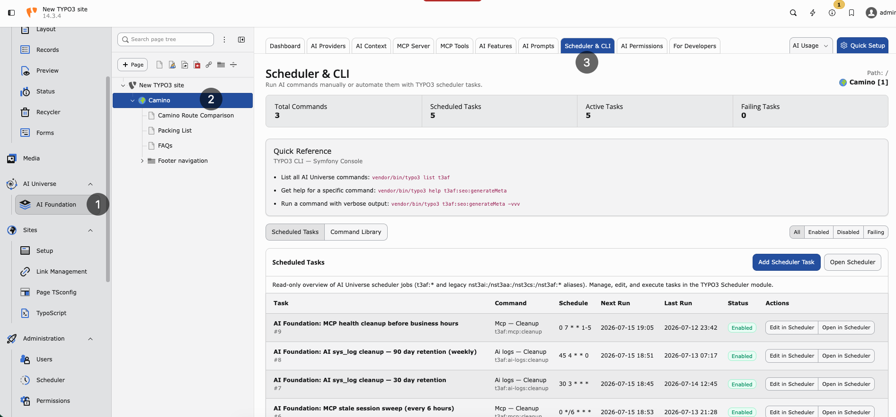

.. include:: ../../Includes.txt

.. _ai-usage-and-logs:

===============
AI Usage & Logs
===============

Purpose
-------

**Transparency** for every AI request on your TYPO3 instance. Use these screens for budget control, debugging, and compliance.

AI Usage
--------

**Path:** :guilabel:`AI Foundation > AI Usage`

`AI Foundation AI Usage Demo <https://app.supademo.com/embed/cmrbpqbgz0fn3qmo5oaq6j1t9?utm_source=link>`__

Shows:

* **Request count** — Total AI calls in the selected period
* **Tokens** — Input and output volume
* **By extension** — Which extension called AI (AI Assistant, AI Chatbot, and others)
* **By feature** — For example ``seo.meta_description``
* **Time range** — Day, week, or month

**Use for:** budget control, team planning, anomaly detection.

Compare usage trends on the :ref:`Dashboard <dashboard>`.

AI Logs
-------

**Path:** :guilabel:`AI Foundation > AI Logs`

`AI Foundation AI Logs Demo <https://app.supademo.com/embed/cmrbpsdl20frlqmo521y5if8m?utm_source=link>`__

Per-request detail includes:

* Timestamp, user, extension, feature
* Provider, model, tokens
* Success or failure

**Use for:** debugging failed requests and compliance audits.

Scheduler & CLI
---------------

**Path:** :guilabel:`AI Foundation > Scheduler & CLI`

`AI Foundation Scheduler and CLI Demo <https://app.supademo.com/embed/cmrbpsi9d0frwqmo59f50ny8s?utm_source=link>`__

   Scheduler & CLI — background tasks and TYPO3 console commands for AI Foundation.

Background jobs and CLI commands. Example:

..  code-block:: bash
    :caption: Flush AI Foundation caches

    vendor/bin/typo3 ns_t3af:cache:flush

Ensure **scheduler cron** runs every minute on production.

OpenAI org statistics (optional)
--------------------------------

Set ``openai_admin_api_key`` in Extension Configuration for organization-level usage charts. This is **not** the chat API key. See :ref:`Configuration <configuration>`.

Privacy
-------

Log detail depends on provider privacy settings and group audit limits from
:ref:`AI Permissions <ai-permissions>`. Configure carefully before enabling full
prompt/response storage.

Weekly admin habit
------------------

1. Open :guilabel:`AI Foundation > AI Usage` and compare the trend with last week
2. Scan :guilabel:`AI Foundation > AI Logs` for repeated failures (same user, same feature)
3. Escalate persistent errors to :ref:`Support <support>` with log details

When logs show high usage
-------------------------

* Check :ref:`AI Features <ai-features>` — bulk tasks may need a cheaper model
* Review group limits in :ref:`AI Permissions <ai-permissions>`
* Ask editors if a script or loop triggered many requests

When logs show failures
-----------------------

* Run Test connection in :ref:`AI Providers <ai-providers>`
* Check vendor status and rate limits
* See :ref:`Known Problems <known-problems>` and :ref:`FAQ <faq>`
