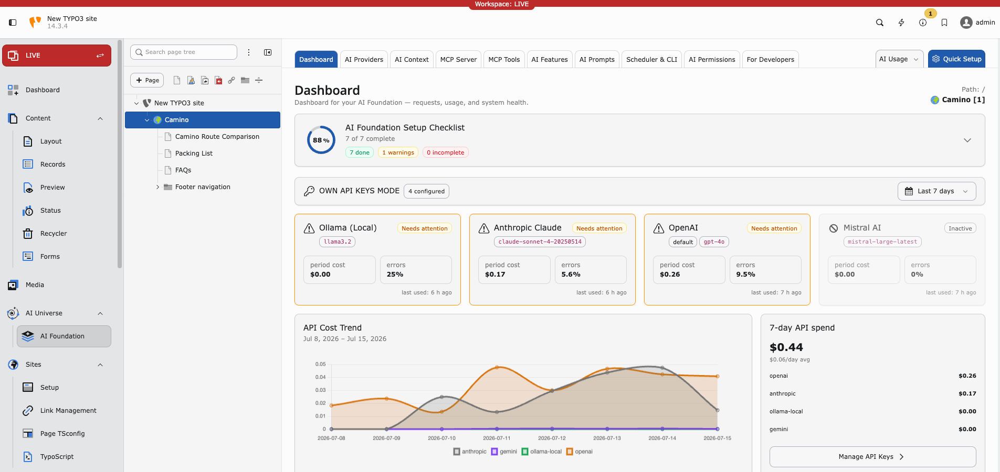
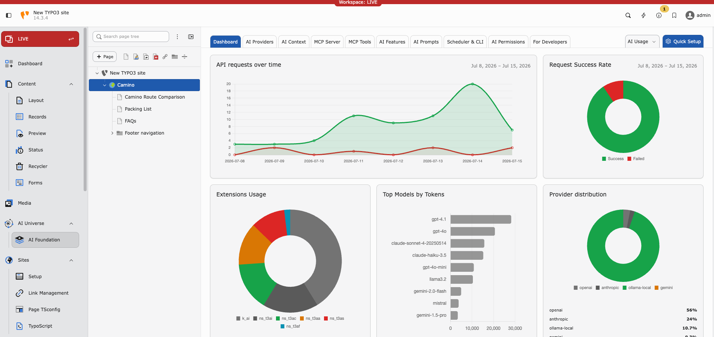
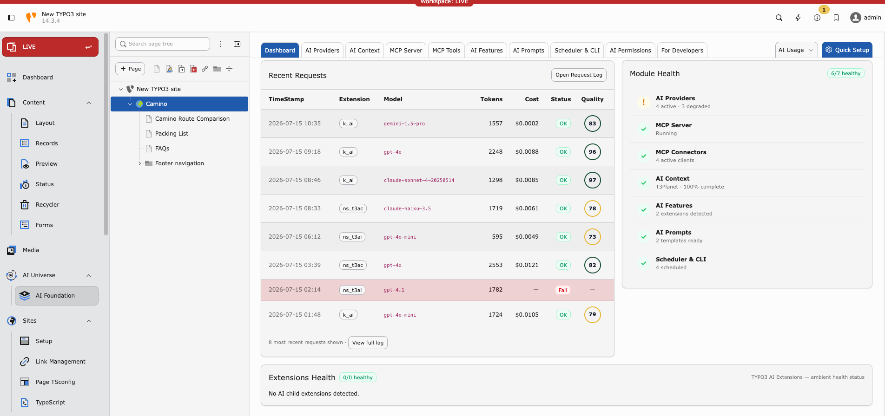

.. include:: ../../Includes.txt

.. _dashboard:

=========
Dashboard
=========

Purpose
-------

The Dashboard is your **control center** for AI health on this TYPO3 instance. Open it daily for a quick status check.

**Path:** :guilabel:`AI Foundation > Dashboard`

`AI Foundation Dashboard Demo <https://app.supademo.com/embed/cmrbp02gg0dysqmo5wfd0olu1?utm_source=link>`__

   Dashboard overview — setup progress, provider health, and API cost trend.

   Usage analytics — requests over time, success rate, top models, and provider distribution.

   Recent requests and module health — request log, costs, and subsystem status.

What the dashboard shows
------------------------

* **Provider status** — Connected, failed, or not tested
* **Default provider** — Active model name
* **Recent usage** — Last requests and token count
* **Quick actions** — Links to AI Providers, MCP Server, and related modules

Daily admin routine (2 minutes)
-------------------------------

1. Open Dashboard
2. Confirm provider status is **green**
3. Skim **AI Logs** if usage looks unusual — see :ref:`AI Usage & Logs <ai-usage-and-logs>`

Status meanings
---------------

* **Green** — Provider OK. No action needed.
* **Yellow** — Not tested recently. Run a Test connection in :ref:`AI Providers <ai-providers>`.
* **Red** — Connection failed. Check API key, model ID, and outbound HTTPS.

Quick links from the dashboard
------------------------------

* **AI Providers** → :ref:`AI Providers <ai-providers>`
* **MCP Server** → :ref:`MCP Server <mcp-server>`
* **View Logs** → :ref:`AI Usage & Logs <ai-usage-and-logs>`

Tips
----

* Set one clear **default provider** — avoids confusion for editors
* Test providers after every key rotation
* Review usage weekly for cost control

When the dashboard shows red
----------------------------

1. Open :ref:`AI Providers <ai-providers>` → run **Test connection**
2. Check vendor status page (OpenAI, Anthropic, etc.)
3. Verify firewall allows outbound HTTPS
4. Check :ref:`AI Logs <ai-usage-and-logs>` for the exact error message
5. See :ref:`Known Problems <known-problems>` if the issue persists
