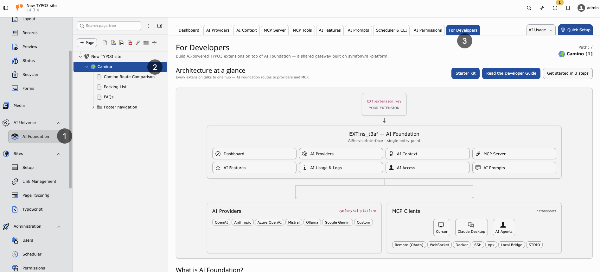

.. include:: ../../Includes.txt

.. _architecture:

============
Architecture
============

Overview
--------

   Architecture at a glance — extensions call AI Foundation, which routes to
   AI providers and MCP clients.

AI Foundation is a shared foundation layer:

..  code-block:: text

   Consuming Extension Code
           |
           v
   AiServiceInterface
           |
           v
   AdapterRegistry -> Provider adapters
           |
           v
      Provider APIs

Parallel support:

..  code-block:: text

   AiStatisticsService -> OpenAiOrganizationUsageService -> OpenAI Usage API
   HttpAuthUtility    -> Protected URL fetching with optional Basic Auth
Main components
---------------

* **Request orchestration**: ``AiServiceInterface`` and ``AiService``
* **Provider adapters**: ``AdapterRegistry`` and ``AdapterInterface`` implementations
* **Statistics processing**: ``AiStatisticsService`` and ``OpenAiOrganizationUsageService``
* **Engine configuration filtering**: ``AiEngineConfiguration``
* **Utility and environment helpers**: ``AiUniverseUtilityHelper``
* **HTTP auth helper**: ``HttpAuthUtility``

Configuration model
-------------------

Runtime AI requests resolve through provider rows in
:ref:`AI Providers <ai-providers>`. Optional extension settings cover
translation helpers, Basic Auth, notifications, and MCP switches. See
:ref:`Configuration <configuration>`.

This includes:

* provider adapters, encrypted API keys, and model IDs
* default provider selection
* optional temperature and capability flags on provider rows
* optional Basic Auth settings for protected URL fetching
Caching
-------

The extension registers cache ``nst3af_statistics`` in ``ext_localconf.php``.

Statistics service stores processed data in this cache to reduce repeated usage API calls.

Constraints
-----------

* No native frontend plugin and no Fluid frontend output in this package.
* Primary role is reusable service infrastructure.
