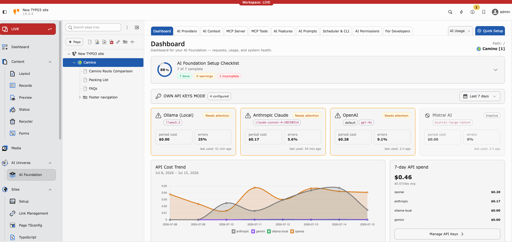

.. include:: Includes.txt

.. _start:

=============
AI Foundation
=============

:Extension key:
   ns_t3af

:Package name:
   nitsan/ns-t3af

:Version:
   1.0.0

:Language:
   en

:Author:
   `T3Planet <https://t3planet.de>`__ & TYPO3 contributors

:License:
   See LICENSE file / COMMERCIAL_LICENSE at Github

:Rendered:
   |today|

----

MCP-first AI foundation for TYPO3. **AI Foundation** turns your TYPO3 installation into a
fully AI-ready platform. Complete AI-infrastructure for the whole TYPO3 team,
zero setup. Manage every AI provider, MCP servers & tools, brand context,
prompts, users permissions, and budget in one native backend module. You stay
in control, your every TYPO3 team (editors, integrators, developers &
administrator) works with AI on one governed, self-hosted foundation. Use it
standalone — or as the foundation that powers the complete AI Universe.
Open source. Free to build. A commercial license for production.

Configure providers, MCP, brand context, prompts, and permissions once —
connected extensions and AI clients reuse them.

   The AI Foundation Dashboard in the TYPO3 backend.

----

Getting started
===============

..  card-grid::
   :columns: 1
   :columns-md: 2
   :gap: 4
   :class: pb-4
   :card-height: 100

   ..  card:: Introduction

      Learn what AI Foundation is, who it is for, and how the pieces fit together.

      ..  card-footer:: :ref:`Read more <introduction-section>`
         :button-style: btn btn-primary stretched-link

   ..  card:: Installation

      Install via Composer, activate the extension, and complete Quick Setup.

      ..  card-footer:: :ref:`Read more <installation>`
         :button-style: btn btn-primary stretched-link

----

For administrators
==================

Set up providers, backend modules, and MCP through the AI Foundation module.

..  card-grid::
   :columns: 1
   :columns-md: 3
   :gap: 4
   :class: pb-4
   :card-height: 100

   ..  card:: Configuration

      Dashboard, providers, context, prompts, features, usage, and access control.

      ..  card-footer:: :ref:`Read more <configuration>`
         :button-style: btn btn-primary stretched-link

   ..  card:: MCP Server

      Expose TYPO3 to Cursor, Claude Desktop, and other MCP clients.

      ..  card-footer:: :ref:`Read more <mcp-server>`
         :button-style: btn btn-primary stretched-link

   ..  card:: User Guide

      Day-to-day guidance for editors, administrators, and stakeholders.

      ..  card-footer:: :ref:`Read more <user-guide>`
         :button-style: btn btn-secondary stretched-link

----

For developers
==============

Build TYPO3 extensions on AI Foundation — shared providers, prompts, features,
and MCP tools without handling API keys in every child extension.

..  card-grid::
   :columns: 1
   :columns-md: 3
   :gap: 4
   :class: pb-4
   :card-height: 100

   ..  card:: Extension Integration

      Call AI Foundation services from your own extension.

      ..  card-footer:: :ref:`Read more <extension-integration>`
         :button-style: btn btn-primary stretched-link

   ..  card:: Developer Guide

      Contracts, custom providers, prompt catalogs, feature cards, and MCP tools.

      ..  card-footer:: :ref:`Read more <developer-guide>`
         :button-style: btn btn-primary stretched-link

   ..  card:: Architecture

      Components, configuration model, and request flow.

      ..  card-footer:: :ref:`Read more <architecture>`
         :button-style: btn btn-secondary stretched-link

----

Help
====

..  card-grid::
   :columns: 1
   :columns-md: 2
   :gap: 4
   :class: pb-4
   :card-height: 100

   ..  card:: Troubleshooting

      Known problems, FAQ, and verified runtime fixes.

      ..  card-footer:: :ref:`Read more <troubleshooting>`
         :button-style: btn btn-primary stretched-link

   ..  card:: Support

      Contact T3Planet support with the details we need to help.

      ..  card-footer:: :ref:`Read more <support>`
         :button-style: btn btn-secondary stretched-link

**Table of Contents**

..  toctree::
   :maxdepth: 3
   :titlesonly:

   Introduction/Index
   Installation/Index
   Configuration/Index
   Integrations/Index
   UserGuide/Index
   DeveloperGuide/Index
   Troubleshooting/Index
   ReleaseNotes/Index
   HelpfulLinks/Index
   Support/Index

..  Meta Menu

..  toctree::
    :hidden:

    Sitemap
