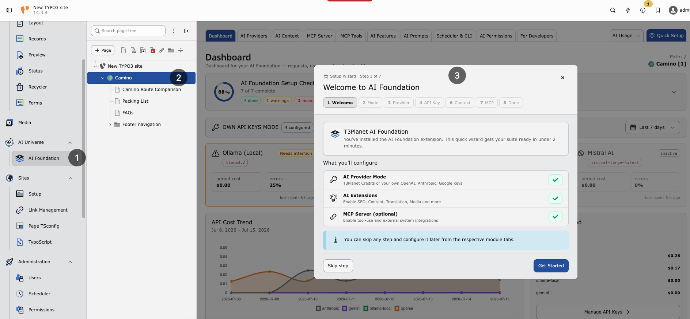

.. include:: ../Includes.txt

.. _installation:

============
Installation
============

.. _quickstart:

Quick start
===========

The recommended way to install this extension is via Composer.

Install the license extension first (if it is not already present), then
AI Foundation (``EXT:ns_t3af``):

..  code-block:: bash
    :caption: Install via Composer

    composer require nitsan/ns-license
    composer require nitsan/ns-t3af
    ./vendor/bin/typo3 extension:setup
    ./vendor/bin/typo3 cache:flush

Classic TYPO3 sites can also install from the
`TYPO3 Extension Repository (TER) <https://extensions.typo3.org/extension/ns_t3af>`__.

After installation:

1. Activate the extensions in :guilabel:`Admin Tools > Extensions`.
2. Open :guilabel:`AI Foundation > Dashboard` and confirm the module group is
   available.
3. Connect providers and API keys in :guilabel:`AI Foundation > AI Providers`.
4. Complete guided options with :guilabel:`Quick Setup` in the AI Foundation
   module header.
5. Clear caches in :guilabel:`Admin Tools > Maintenance`.

   Quick Setup wizard — guided first-time configuration in the AI Foundation module.

Continue with :ref:`Configuration <configuration>` for providers, MCP, and
day-to-day module setup.

Composer installation
=====================

.. _system-requirements:

Requirements
------------

Ensure your system meets these requirements:

* **TYPO3** — 12.4 LTS, 13.4 LTS, or 14.x
* **PHP** — 8.2 or higher (8.3 recommended), including ``ext-sodium``
* **Composer** — 2.x
* **Database** — MySQL 8.0+ or MariaDB 10.3+
* **Network** — Outbound HTTPS for AI provider API calls

Required Extensions
-------------------

Install and activate these extensions before AI Foundation:

* **ns_license** — License activation and premium feature validation
* **scheduler** — Background AI jobs and scheduled tasks
* **workspaces** — Draft workspaces, MCP workflows, and safe content editing

``scheduler`` and ``workspaces`` ship with TYPO3. Activate them if they are
not already enabled.

Install the license extension
-----------------------------

``EXT:ns_license`` must be installed first. AI Foundation depends on it for
license checks. The extension is free on the
`TYPO3 Extension Repository <https://extensions.typo3.org/extension/ns_license>`__.

..  code-block:: bash
    :caption: Install ns_license via Composer

    composer require nitsan/ns-license

Or use :guilabel:`Admin Tools > Extensions > Get Extensions`, search for
``ns_license``, install and activate it, then flush caches.

Install AI Foundation
---------------------

``EXT:ns_t3af`` must be installed after ``EXT:ns_license``. Find it on the
`TYPO3 Extension Repository <https://extensions.typo3.org/extension/ns_t3af>`__.

..  code-block:: bash
    :caption: Install AI Foundation via Composer

    composer require nitsan/ns-t3af

Or use :guilabel:`Admin Tools > Extensions > Get Extensions`, search for
``ns_t3af`` (or **T3AF**), install and activate it, then flush caches.

Get your free license key
-------------------------

A free license key is required to activate AI Foundation. After you install
``EXT:ns_t3af``, get your free license key and enter it before you continue
with configuration:

https://t3planet.de/en/ai-foundation-for-typo3#c19775

Activate the extension
~~~~~~~~~~~~~~~~~~~~~~

Confirm ``ns_t3af`` is active in :guilabel:`Admin Tools > Extensions`.

Set up the database and clear caches
~~~~~~~~~~~~~~~~~~~~~~~~~~~~~~~~~~~~

..  code-block:: bash
    :caption: Extension setup and cache flush

    ./vendor/bin/typo3 extension:setup
    ./vendor/bin/typo3 cache:flush

Manual installation
===================

If you cannot use Composer, install both extensions from the TER in this order:

1. Open :guilabel:`Admin Tools > Extensions > Get Extensions`.
2. Search for ``ns_license``, install and activate it, then flush caches.
3. Search for ``ns_t3af`` (or **T3AF**), install and activate it.
4. Run **Analyze Database Structure**.
5. Flush caches again.

.. warning::

   Manual installation requires manual dependency management. Composer
   installation is strongly recommended.

Verify the installation
=======================

Confirm that:

* ``ns_license`` and ``ns_t3af`` are listed as active in
  :guilabel:`Admin Tools > Extensions`
* The **AI Foundation** module group appears in the backend sidebar
* **Analyze Database Structure** reports no pending changes for ``ns_t3af``

If the module is missing, flush caches and run
``./vendor/bin/typo3 extension:setup`` again.

Next steps
==========

Open :guilabel:`AI Foundation > AI Providers` to connect at least one provider,
then review :ref:`Configuration <configuration>`.
