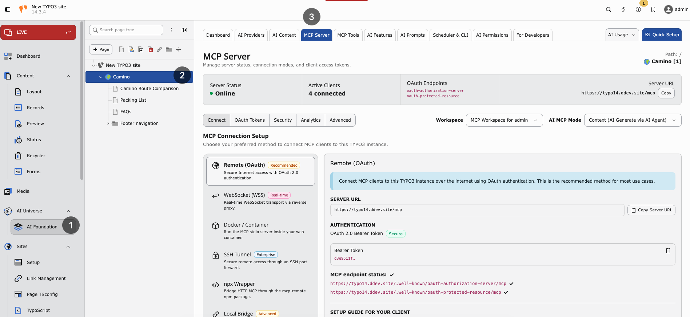

.. include:: ../../Includes.txt

.. _mcp-server:

==========
MCP Server
==========

Purpose
-------

Connect external AI agents to TYPO3 through the **Model Context Protocol (MCP)**. Tools like **Cursor**, **Claude Desktop**, and **n8n** can read pages, inspect schema, and update records (with permissions).

**Path:** :guilabel:`AI Foundation > MCP Server`

`AI Foundation MCP Server Demo <https://app.supademo.com/embed/cmrbp5q660ej4qmo546ztyk1h?utm_source=link>`__

   MCP Server — online status, connection methods, and Remote OAuth endpoint details.

What MCP does
-------------

* Read TYPO3 pages and content
* Inspect database schema
* Create or update records (with permissions)
* Call extension-registered tools (see :ref:`MCP Tools <mcp-tools>`)

Enable MCP
----------

1. Open :guilabel:`AI Foundation > MCP Server > Advanced`.
2. Enable the MCP server checkbox (``enableMcpServer``).
3. Flush caches → status should show **Online**.

The setting is also available in AI Foundation extension settings under the
**MCP Server** group. It is not part of the classic TYPO3
:guilabel:`Admin Tools > Settings > Extension Configuration` form.

Health check
------------

..  code-block:: bash
    :caption: MCP endpoint health check

    curl -sS -o /dev/null -w "%{http_code}" https://your-site.com/mcp
    # Expect: 401 (auth required = good)

..  code-block:: bash
    :caption: OAuth discovery endpoint

    curl -sS https://your-site.com/.well-known/oauth-authorization-server/mcp
    # Expect: JSON 200

Connection methods
------------------

* **Remote OAuth** — Production and Cursor. Uses OAuth 2.1 with PKCE.
* **mcp-remote** — Simple HTTP clients. Uses URL token.
* **Local CLI** — DDEV and local development. Uses backend user and workspace.

MCP modes
---------

Set the mode in the **MCP Server** top bar (stored as ``mcpMode`` in the
AI Foundation MCP settings).

**Context (AI Generate via AI Agent)** — Default for Cursor, Claude Desktop,
and similar clients.

* The external AI agent generates content outside TYPO3.
* MCP tools apply and save that content into TYPO3 (pages, records, files).
* Use this when the model and reasoning run in the client, and TYPO3 is the
  CMS tool layer.

**Native (AI Generate via TYPO3)** — Server-side generation.

* TYPO3 runs AI generation on the server through your configured
  :ref:`AI Providers <ai-providers>`.
* MCP tools receive instructions and generate or process content inside TYPO3.
* Use this when generation must stay on your instance (provider keys, brand
  context, and governance already configured in AI Foundation).

Some dual-mode content tools change their argument requirements and
descriptions based on the active mode. After switching mode, reconnect or
refresh your MCP client so the tool list updates.

Core tools
----------

AI Foundation ships a large **TYPO3 Core** tool catalog (pages, content, records,
files, workspaces, scheduler, permissions, redirects, cache, and more). Browse
the full list in :guilabel:`AI Foundation > MCP Tools`.

Starter examples for first checks:

* ``table_schema`` — Field metadata for any table
* ``pages_get`` — Read one page
* ``content_list`` — List content on a page
* ``write_table`` — Create, update, or delete records

Child extensions can register additional tools — also visible in the **MCP Tools** tab.

Workspaces
----------

* **0** — Live workspace
* **1+** — Draft workspace

MCP edits respect the active workspace. Test writes in workspace ``1`` before live.

Cursor example (stdio / DDEV)
-----------------------------

.. code-block:: php

   {
     "mcpServers": {
       "typo3": {
         "command": "bash",
         "args": ["-lc", "cd /path/to/project && ddev exec php vendor/bin/typo3 ns_t3af:mcp:serve --no-startup-message -u admin -w 0"]
       }
     }
   }

Security
--------

* Use **HTTPS** in production
* Treat URL tokens like passwords
* Limit which backend users can authorize OAuth
* Test in draft workspace before live writes
* Enable :ref:`AI Permissions <ai-permissions>` for multi-user sites

When to enable MCP
------------------

* Developers use Cursor or Claude Desktop with TYPO3 daily
* Automation workflows via n8n need CMS access
* Staging environment for safe agent testing

When not to enable yet
----------------------

* Production site without HTTPS
* No clear policy for which admins may authorize agents
* Team has not completed :ref:`AI Providers <ai-providers>` setup

.. note::

   * Model Context Protocol: https://modelcontextprotocol.io/
