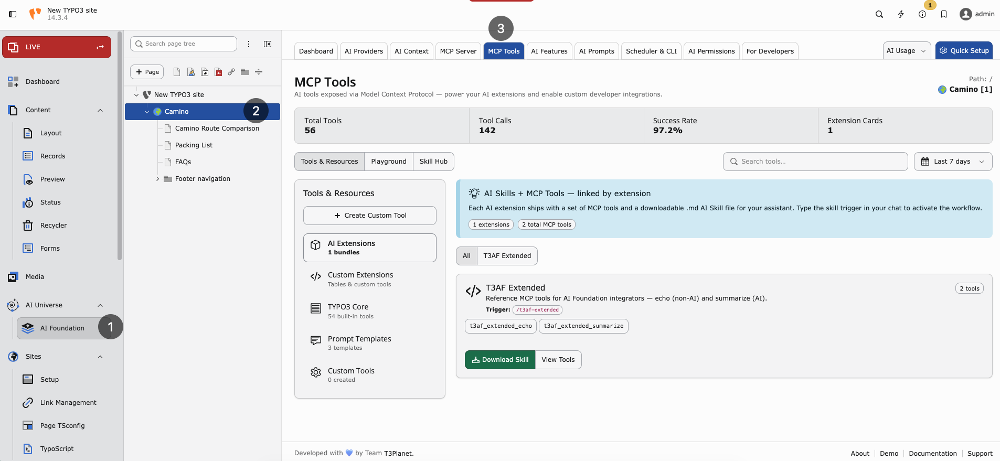

.. include:: ../../Includes.txt

.. _mcp-tools:

=========
MCP Tools
=========

Purpose
-------

The **MCP Tools** screen lists every tool an AI agent can call against your TYPO3 instance. Core tools ship with AI Foundation. Child extensions can register additional tools.

**Path:** :guilabel:`AI Foundation > MCP Tools`

`AI Foundation MCP Tools Demo <https://app.supademo.com/embed/cmrbpdgzl0f4zqmo5tbj5kbah?utm_source=link>`__

   MCP Tools — Core catalog, extension cards, and tool statistics.

What you see
------------

* **Tool catalog** — All registered MCP tools with descriptions
* **Playground** — Test a tool call without leaving the backend
* **Extension cards** — Tools contributed by installed T3Planet AI extensions

Core tools
----------

These tools ship with AI Foundation and appear under the **TYPO3 Core** tab in
:guilabel:`AI Foundation > MCP Tools` when the :ref:`MCP Server <mcp-server>` is enabled.

The Core catalog covers many tools across categories such as Content, Records,
Schema, Files, Workspaces, Search, Cache, and related TYPO3 operations. Open the
MCP Tools module to see the complete, up-to-date list.

Starter examples for first checks:

* ``table_schema`` — Field metadata for any database table
* ``pages_get`` — Read a single page record
* ``content_list`` — List content elements on a page
* ``write_table`` — Create, update, or delete records (permission-controlled)

**Warning:** Test write operations in a **draft workspace** before using live workspace ``0``.

Extension-registered tools
--------------------------

When AI Assistant, AI Chatbot, AI Search, or other connected extensions are installed, their MCP tools appear automatically in the catalog. Each card shows:

* Tool name and description
* Required permissions
* Link to the extension documentation

Playground workflow
-------------------

1. Open :guilabel:`AI Foundation > MCP Tools` in the TYPO3 backend.
2. Select a tool from the catalog (start with read-only tools like ``pages_get``).
3. Fill in required fields (page UID, table name, and so on).
4. Run the tool and inspect the JSON response before connecting external agents.

Why use the playground
----------------------

* Verify MCP is online before configuring Cursor
* Debug permission errors with a known backend user
* Show stakeholders what agents can access without installing client software

Security
--------

* Tools respect backend user permissions and workspace context
* OAuth and URL tokens are configured on the :ref:`MCP Server <mcp-server>` screen
* Limit which admin users may authorize external agents
* Use draft workspaces for ``write_table`` tests

When to use MCP Tools vs MCP Server
-----------------------------------

* **MCP Server** — Enable connectivity, OAuth, and client configuration
* **MCP Tools** — Browse tools, test calls, see extension contributions

See :ref:`MCP Server <mcp-server>` for connection setup.
