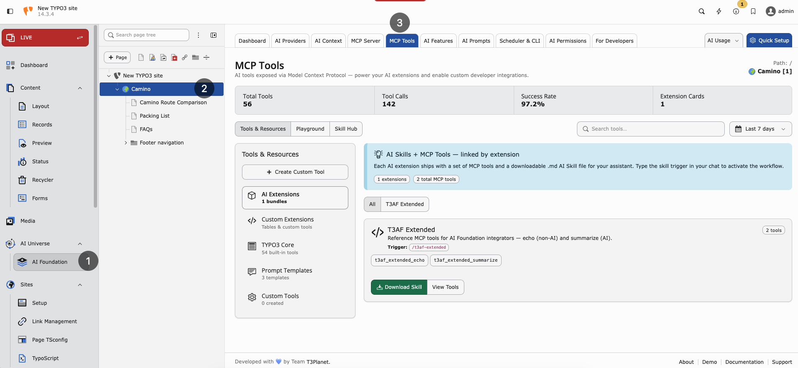

.. include:: ../../Includes.txt

.. _mcp-tools:

=========
MCP Tools
=========

Purpose
-------

The **MCP Tools** screen lists every tool an AI agent can call against your TYPO3 instance. Core tools ship with AI Foundation. Child extensions can register additional tools.

**Path:** :guilabel:`AI Foundation > MCP Tools`

`AI Foundation MCP Tools Demo <https://app.supademo.com/embed/cmrbpdgzl0f4zqmo5tbj5kbah?utm_source=link>`__

   MCP Tools — Core catalog, extension cards, and tool statistics.

What you see
------------

* **Tool catalog** — All registered MCP tools with descriptions
* **Playground** — Test a tool call without leaving the backend
* **Extension cards** — Tools contributed by installed T3Planet AI extensions

Core tools
----------

These tools ship with AI Foundation and appear under the **TYPO3 Core** tab in
:guilabel:`AI Foundation > MCP Tools` when the :ref:`MCP Server <mcp-server>` is enabled.

The Core catalog covers many tools across categories such as Content, Records,
Schema, Files, Workspaces, Search, Cache, and related TYPO3 operations. Open the
MCP Tools module to see the complete, up-to-date list.

Starter examples for first checks:

* ``table_schema`` — Field metadata for any database table
* ``pages_get`` — Read a single page record
* ``content_list`` — List content elements on a page
* ``write_table`` — Create, update, or delete records (permission-controlled)

**Warning:** Test write operations in a **draft workspace** before using live workspace ``0``.

.. _mcp-tools-batch-writes:

Batch writes: records_apply and records_undo
--------------------------------------------

``records_apply`` creates, updates, deletes and moves **many records across tables in one call**. Everything runs
as one TYPO3 DataHandler run inside one database transaction: if anything is refused or fails, **nothing** is
written. Your own backend permissions apply (tables, fields, pages, workspaces).

.. code-block:: json

   {
     "data": {
       "pages": {"NEWpage": {"pid": 1, "title": "Landing"}},
       "tt_content": {
         "NEWc1": {"pid": "NEWpage", "CType": "text", "header": "Welcome"},
         "NEWc2": {"pid": "NEWpage", "CType": "text", "header": "Details"}
       }
     },
     "cmd": {"tt_content": {"17": {"delete": 1}}},
     "dryRun": true
   }

* **data** — ``table => uid or NEWid => fields``. A new record uses an id of ``NEW`` plus letters and digits (no
  underscore) and needs a ``pid``. Other records in the same call may point at it (``"pid": "NEWpage"``), and file,
  inline and category fields accept lists of new ids.
* **cmd** — ``delete``, ``undelete``, ``move``, ``copy`` and ``localize`` per record uid.
* **bulk** — a shorthand for one change on many records of a table:
  ``[{"table": "tt_content", "uids": [1, 2, 3], "set": {"hidden": 1}}]``. Use ``"delete": true`` or
  ``"move": <target>`` instead of ``set``. Bulk and ``*_move_batch`` moves keep the order of the request
  on the target page when the table has a sort field (the first record takes the target; each following
  one is placed after the previous). Hand-written ``cmd`` moves are unchanged.
* **append** (default on) — new records land after the existing ones on their page, in the order sent. A negative
  ``pid`` places a record after that record.
* **strict** (default on) — refuses the whole call if a field is not writable and names it; with ``strict=false``
  such fields are dropped and reported under ``ignoredFields``.
* **dryRun** — runs everything for real, reports what would happen, then rolls everything back. Use it first for
  deletes and large batches. Anything a hook does outside the database (a queue message, an HTTP call) is not
  rolled back.
* **requestId** — makes a retry safe. Resend the same request with the same id after a timeout and it is applied
  once; the second answer is the stored first one with ``replayed: true``. The same id with a different request is
  refused while a call is finished or still running. A ``pending`` call that died (no finish within 10 minutes) can
  be taken over, including with a corrected payload. Field-name key order inside each record does not matter for the
  match; table order, record order and list order do. An id is remembered for the setting ``mcpIdempotencyTtlHours``
  (default 24 hours). Dry runs ignore it.
* **fromFile** — the ``sys_file`` uid of a ``.json`` file you uploaded, holding ``{"data": {}, "cmd": {}, "bulk": []}``
  (each key optional), for batches too big to send inline (up to 10 MB; inline calls are capped at 2 MiB). You need
  read access to the file, and its content is checked exactly like inline arguments.

Limits: 500 records per call (data plus cmd plus bulk). The answer lists the ``map`` (new id to uid), the
``operations`` per table and a ``batchId``. Field values are never echoed or logged; the audit log keeps tables,
operation counts, field names and the batch id.

``records_undo`` takes a whole batch back by its ``batchId``: records it created are deleted, records it deleted are
restored, changed fields get their old values back and moved records return to their position. It is one atomic call
through the same engine, with a dry run. It refuses, and writes nothing, when

* anybody changed one of those records **after** the batch (this also stops the same undo from running twice),
* pages the batch created now hold records it did not create,
* the batch ran in a workspace (take it back with ``workspace_discard``), or belongs to another backend user.

Relation fields that appear in the history diff are listed under ``notRestored`` and are not restored; records the
batch created (for example file references) are removed by the undo. An undo is a batch itself and can be undone in
turn.

The generated ``<prefix>_delete_batch``, ``<prefix>_update_batch`` and ``<prefix>_move_batch`` tools of every
discovered table run on the same engine, so they are all-or-nothing too. Each accepts at most 500 uids per call
(refused before any lookup) and returns a ``batchId`` that ``records_undo`` accepts (history is keyed by that id,
not by the tool name in the audit log).

``write_table`` uses the same engine for scalar and relation field writes (one transaction). File fields
(``[{"uid_local": N, ...}]``) are attached **after** that commit in a separate DataHandler pass, so a
file-attach failure does not roll back the create or update. ``write_table`` does not return a ``batchId``.

``records_apply`` and ``write_table`` refuse a table, and a field, that the backend user may not edit (a field
marked ``exclude`` in the TCA needs the field grant, and structural fields such as ``CType``, ``colPos`` or
``hidden`` are not changed through a create the user may not make). A text field that holds one run of more than
256 KB without a space or line break is refused with a clear message, because TYPO3 cannot index it. ``map`` in
the reply is an empty object (``{}``) when nothing new was created, also after ``records_undo``.

Records written through MCP tools are recorded as AI-involved in the AI Label module (source ``mcp``). Switch this
off with the extension setting ``mcpMarkWritesAsAi``.

Manual checks worth running against a live MCP client
~~~~~~~~~~~~~~~~~~~~~~~~~~~~~~~~~~~~~~~~~~~~~~~~~~~~~

* **Stale takeover with a corrected payload** — start a ``records_apply`` with a ``requestId``, kill the client
  before it finishes, wait more than 10 minutes (or age the ``pending`` row), then resend the same ``requestId``
  with a fixed payload. Expect the corrected write, not ``1790500012``.
* **Batch tool then undo** — call ``*_update_batch`` (or delete/move), take ``batchId`` from the answer, call
  ``records_undo`` with it. Expect the previous field values / undelete / previous position.
* **Key-order-only retry** — finish a ``records_apply`` with a ``requestId``, then retry with the same id and the
  same records but field names reordered inside each record. Expect ``replayed: true`` and no second write.
  Swapping two records under the same table must still be refused with ``1790500012``.

.. note::
   ``records_apply`` and ``records_undo`` are available to external MCP clients. They are intentionally hidden from
   the AI Agent: its approval flow shows one record and its fields at a time and cannot present a batch with
   cross-referenced new records. The Agent keeps using ``write_table`` and the single-record tools.

Extension-registered tools
--------------------------

When AI Assistant, AI Chatbot, AI Search, or other connected extensions are installed, their MCP tools appear automatically in the catalog. Each card shows:

* Tool name and description
* Required permissions
* Link to the extension documentation

Playground workflow
-------------------

1. Open :guilabel:`AI Foundation > MCP Tools` in the TYPO3 backend.
2. Select a tool from the catalog (start with read-only tools like ``pages_get``).
3. Fill in required fields (page UID, table name, and so on).
4. Run the tool and inspect the JSON response before connecting external agents.

Why use the playground
----------------------

* Verify MCP is online before configuring Cursor
* Debug permission errors with a known backend user
* Show stakeholders what agents can access without installing client software

Security
--------

* Tools respect backend user permissions and workspace context
* The MCP Server settings (mode, advanced settings, scopes, IP allowlist, mTLS, analytics export, health ping)
  need an administrator, or the AI Foundation module with the MCP Server tab visible
* ``cache_clear`` with scope ``pages`` (all page caches) needs ``options.clearCache.pages = 1`` for non-admins,
  as in TYPO3 core; scope ``all`` needs ``options.clearCache.all``; one page needs edit rights on it
* OAuth and URL tokens are configured on the :ref:`MCP Server <mcp-server>` screen
* Limit which admin users may authorize external agents
* Use draft workspaces for ``write_table`` tests

When to use MCP Tools vs MCP Server
-----------------------------------

* **MCP Server** — Enable connectivity, OAuth, and client configuration
* **MCP Tools** — Browse tools, test calls, see extension contributions

See :ref:`MCP Server <mcp-server>` for connection setup.
