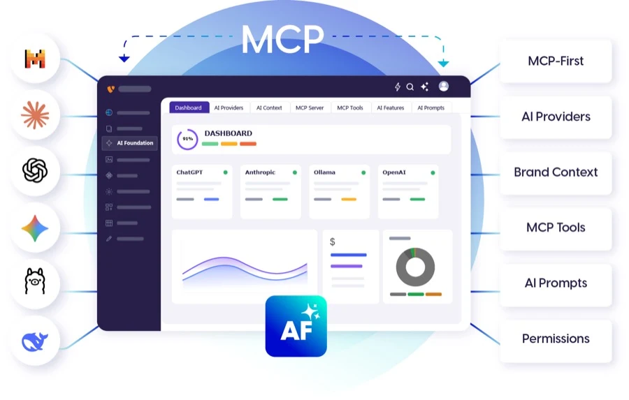

.. include:: ../../Includes.txt

.. _introduction:

========
Overview
========

**AI Foundation** (``EXT:ns_t3af``) is T3Planet’s shared AI foundation for TYPO3.
It is the central engine behind all T3Planet AI extensions.

AI Foundation connects TYPO3 to AI models, manages API keys, exposes an MCP
server for AI agents, and logs every request — so your team uses AI in a safe,
consistent way. Editors work through connected extensions such as AI Assistant
or AI Chatbot. Admins configure everything in the **AI Foundation** backend
module group.

Key capabilities
----------------

* **AI Providers** — Connect OpenAI, Claude, Gemini, and other vendors with encrypted API keys
* **MCP Server** — Expose TYPO3 to Cursor, Claude Desktop, and other MCP clients
* **AI Context** — Store brand voice once for on-brand AI output
* **AI Prompts & Features** — Shared prompt templates and per-feature provider assignment
* **Usage & Logs** — Token usage, request history, and operational telemetry
* **Access & Governance** — Permissions, budgets, rate limits, and log privacy
* **Quick Setup** — Guided first-time configuration wizard

Helpful Links
-------------

.. note::

   * Product: https://t3planet.de/ai-foundation-fur-typo3
   * Get support: https://t3planet.de/support
   * License activation: https://docs.t3planet.de/en/latest/License/Index.html
