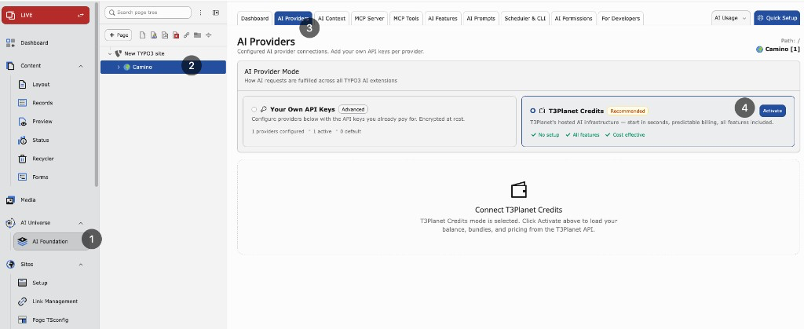
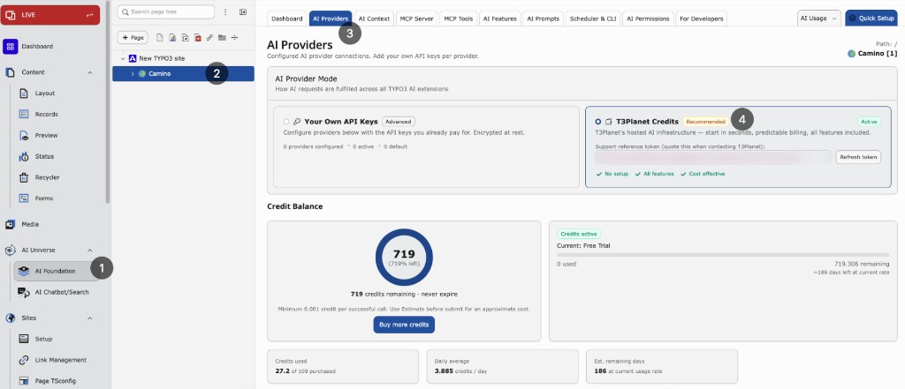

.. include:: ../../Includes.txt

.. _t3planet-credits-configuration:

=============
Configuration
=============

Turn on T3Planet Credits from AI Foundation and manage limits and top-ups.

**Path:** :guilabel:`AI Foundation > AI Providers`

Before you start
================

* AI Foundation (``EXT:ns_t3af``) installed and active
* Valid T3Planet license available (``EXT:ns_license``)
* Server can reach the T3Planet API

Activate Credits
================

1. Open :guilabel:`AI Foundation > AI Providers`.
2. Choose :guilabel:`T3Planet Credits`.
3. Confirm if asked.
4. Click :guilabel:`Activate` if shown.
5. Wait for success → page reloads.

   Select :guilabel:`T3Planet Credits`, then click :guilabel:`Activate`.

   After activation — :guilabel:`T3Planet Credits` active, balance panel, and
   :guilabel:`Buy more credits`.

.. note::

   If Activate fails, check that your T3Planet license is valid, the server can
   reach the T3Planet API, and try again. See
   :ref:`Troubleshooting <t3planet-credits-troubleshooting>` for common fixes.

After activation
================

When Credits is active:

* Billable AI calls go through T3Planet and use your credit balance
* Usage is logged in :guilabel:`AI Usage` as ``t3planet_credits``
* Credits panels appear and the own provider list is hidden
* Balance is available on the Dashboard and Credits panel
* Switching back to :guilabel:`Your Own API Keys` restores your saved providers

Group limits
============

Set per-group usage caps in :guilabel:`AI Foundation > AI Permissions`.

1. Open :guilabel:`AI Permissions`.
2. Select the backend usergroup.
3. Configure credit-related limits for that group.

What can be capped:

* **Monthly credit limit** — Maximum credits the group may use per month
* **Daily request limit** — Maximum AI requests the group may send per day

Administrator users are exempt from these caps.

Buy more credits
================

When your balance is low, open :guilabel:`Buy more credits` on the Credits
panel or Dashboard. You complete purchase on the T3Planet checkout page;
invoices stay in your T3Planet account.

.. warning::

   If T3Planet returns a rate-limit message, wait for the shown cooldown before
   retrying.
