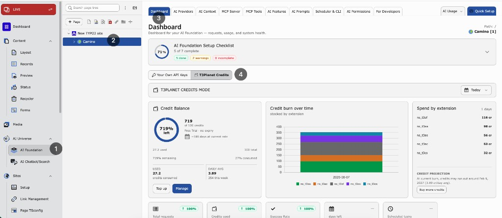

.. include:: ../Includes.txt

.. _t3planet-credit-system:

================
T3Planet Credits
================

Purpose
=======

**T3Planet Credits** is T3Planet’s managed AI access for AI Foundation.
It lets your TYPO3 site use AI features **without storing or managing your own
vendor API keys**.

When Credits is active, AI Foundation sends billable AI requests to T3Planet.
T3Planet runs the AI work and reduces your **credit** balance. In
:guilabel:`AI Usage`, those requests are stored with provider id
``t3planet_credits``.

**Path:** :guilabel:`AI Foundation > AI Providers`

.. note::

   On :guilabel:`AI Providers` you can choose between :guilabel:`Your Own API Keys`
   and :guilabel:`T3Planet Credits`.

   Dashboard — :guilabel:`T3Planet Credits` mode with remaining balance, credit
   burn over time, and spend by extension.

What you get
============

* You'll receive 50 free credits once upon signup
* AI features without configuring OpenAI, Anthropic, Gemini, Mistral, or similar
  keys
* One shared credit balance for this installation
* Balance on the Dashboard and AI Providers Credits panel
* Clear usage history in :guilabel:`AI Usage` (provider ``t3planet_credits``)

What's covered
==============

Credits can be used for these AI Foundation capabilities when Credits is active:

* Text completion
* Streaming
* Embeddings
* Text-to-speech (TTS)
* Image generation

When to use it
==============

Use Credits when you want editors to use AI quickly without key setup.

Use Own API Keys when you already manage vendor accounts and keys yourself.

Default is **Own API Keys**. Credits stays off until you select it and complete
:guilabel:`Activate`. Your saved providers stay in the database and are available
again when you switch back to :guilabel:`Your Own API Keys`.

..  toctree::
   :maxdepth: 2
   :titlesonly:

   Overview/Index
   Configuration/Index
   AIUsage/Index
   MCPIntegration/Index
   Troubleshooting/Index
