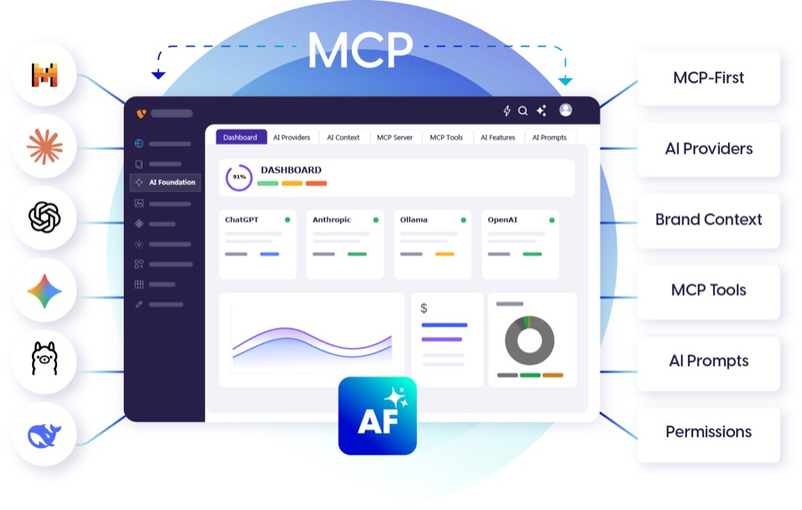

[](https://extensions.typo3.org/extension/ns_t3af)
[](https://github.com/nitsan-technologies/ns_t3af)
[](https://get.typo3.org/version/14)
[](https://get.typo3.org/version/13)
[](https://get.typo3.org/version/12)
[](https://www.php.net/)

# AI Foundation for TYPO3 Extension `ns_t3af`

[](https://t3planet.de/ai-foundation-fur-typo3)

AI Foundation gives TYPO3 CMS a built-in MCP server, 100+ AI tools and multi-LLM management to connect Claude, Cursor, n8n and other AI agents while controlling providers, prompts, permissions and budgets from one backend module. Open source and self-hosted on your own infrastructure with your own keys; T3Planet never sits in your data path.

It includes these features:

* **MCP Server:** TYPO3 becomes a native MCP endpoint. Claude Desktop, Cursor, n8n, Windsurf and VS Code Copilot can read and write TYPO3 content directly without custom middleware. Supports 7 transport methods, OAuth 2.1 with PKCE, IP allowlisting, mutual TLS, MCP Gateway/Proxy mode for multi-site agencies, and a Webhook-to-MCP Bridge for external triggers.

* **100+ MCP Tools:** A full catalog of AI-usable tools across content, pages, SEO, translation, media and more. Auto-discovery registers any installed extension's database tables as tools automatically. Includes a live Playground to test tools and a Developer Kit to build your own.

* **Multi-LLM Management:** Configure OpenAI, Anthropic, Gemini, Ollama and any OpenAI-compatible provider. Set priority and failover ordering per extension. Per-extension monthly budget caps with on/off toggles.

* **AI Context:** Multi-profile brand voice engine. Define business identity, tone, target audience, keywords, forbidden words and compliance notes once. Inject into every AI action across all extensions. Supports multiple client profiles for agencies and auto-research from a URL.

* **Role-based Access & Permissions:** Guided wizard over TYPO3 backend usergroups. Per-group credit limits, module access, fine-grained feature permissions, record-level and page-scope restrictions. Safe AI access for junior staff, clients and freelancers.

* **AI Usage & Logs:** Request-level log with model, tokens, cost, duration and user. 30-day rollup summaries by provider, module, model and user. CSV export, 90-day retention. System-level operational log for sync jobs, errors and scheduler events.

* **Bulk Operations:** Multi-select pages from the page tree, choose an AI action (meta tags, content rewrite, translation, alt text, summary), see a live cost estimate, and run across all selected pages in one step.

* **Scheduler & CLI:** Every AI action is a native Symfony Console command and a TYPO3 Scheduler task. Automate nightly meta generation, translation sync, alt-text generation and more.

* **MCP Connectors:** Connect TYPO3's AI features to external services — Notion, GitHub, Slack, PostgreSQL, Google Drive, Linear, Jira and more, each as a one-click configurable connector.

* **AI Prompts:** Centralized library of 63 editable prompt templates across 9 categories and 7+ extensions. Every AI instruction across SEO, content, translation, media and chat is inspectable and customizable.

|                       | URL                                                                 |
|-----------------------|---------------------------------------------------------------------|
| **Repository:**       | https://github.com/nitsan-technologies/ns_t3af                      |
| **Issues:**           | https://github.com/nitsan-technologies/ns_t3af/issues               |
| **Composer:**         | https://packagist.org/packages/nitsan/ns-t3af                       |
| **TER:**              | https://extensions.typo3.org/extension/ns_t3af                      |
| **Product Page:**     | https://t3planet.de/ai-foundation-fur-typo3                         |
| **Documentation:**    | https://docs.t3planet.de/en/latest/                                 |
| **Support:**          | https://t3planet.de/en/support                                      |
| **Community:**        | https://typo3.slack.com                                             |
| **Contribution:**     | [CONTRIBUTING.md](CONTRIBUTING.md)                                  |
| **License (code):**   | [LICENSE](LICENSE) (GPL-2.0-or-later)                               |
| **Commercial:**       | [COMMERCIAL-LICENSE.md](COMMERCIAL-LICENSE.md)                      |

## Compatibility

| T3AF Version | TYPO3 Compatibility | PHP Version | Support Level                          |
|--------------|---------------------|-------------|----------------------------------------|
| v1.x         | 12.4 - 14.x         | 8.2 - 8.5   | Features, Bugfixes, Security Updates   |

## Licensing

T3AF is open source under GPL-2.0-or-later.

A license key is required for all environments:

- **Free key** — development, staging and local environments (always free)
- **Commercial license** — production use, annual per domain, includes updates, support and legal certainty

Get your key: https://t3planet.de/ai-foundation-fur-typo3

Immediate license delivery. Included with every AI Universe extension license.

## Compatible Extensions

T3AF is the required foundation for six AI extensions by T3Planet. Install T3AF once and add the extensions your project needs.

| Extension | Description                          | Link                                              |
|-----------|--------------------------------------|---------------------------------------------------|
| **T3AI**  | AI Content Assistant for TYPO3       | https://t3planet.de/t3ai-typo3-erweiterung        |
| **T3AC**  | AI Chatbot for TYPO3                 | https://t3planet.de/t3ac-typo3-erweiterung        |
| **T3AS**  | AI Search for TYPO3                  | https://t3planet.de/t3as-typo3-erweiterung        |
| **T3AA**  | AI Accessibility for TYPO3           | https://t3planet.de/t3aa-typo3-erweiterung        |
| **T3AL**  | AI XLIFF Localisation for TYPO3      | https://t3planet.de/t3al-typo3-erweiterung        |
| **T3AB**  | AI Extension Builder for TYPO3       | https://t3planet.de/t3ab-typo3-erweiterung        |

## Installation

```bash
composer require nitsan/ns-t3af
```

Activate `ns_t3af` in the TYPO3 backend, then open **AI Foundation** (Admin Tools) and complete Quick Setup.
