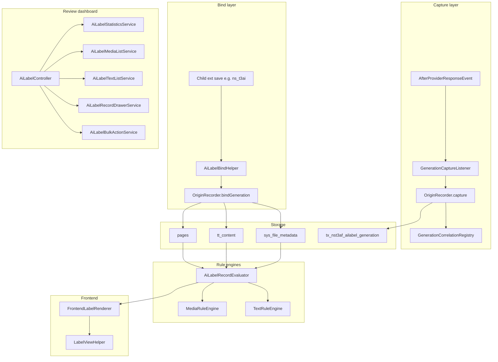

> **Agent entry:** `context/features/ai-label.md`  
> **User doc:** `Documentation/Configuration/AiLabel/Index.rst`

# Feature — AI Label (EU AI Act Article 50)

Status: **Implemented** (backend dashboard, rule engines, capture/bind, frontend renderer, evidence export)  
Owner: ns_t3af maintainers  
Compliance input: `Configuration/BuildInputs/compliance-strings.json` (fail-closed build)

---

## Goals

1. Record AI involvement on **media** (`sys_file_metadata`) and **text** (`pages`, `tt_content`, optional extension tables).
2. Require **person confirmation** before visitor-facing labels count as reviewed.
3. Apply **different rule sets** for media (Art. 50(4)) vs text (public interest + editorial control).
4. Provide a **backend review dashboard** with filters, bulk actions, per-record drawer, and evidence export.
5. **Capture** all AI Foundation generations automatically; **bind** at child-extension save points.

Non-goals: legal advice, automatic compliance certification, ns_t3al translation workflow (planned blind spot).

---

## Architecture



---

## Domain model

### Involvement (`Involvement` enum)

| Value | Meaning |
|---|---|
| `not_reviewed` | Default; no decision yet |
| `no_ai` | Editor asserts no AI |
| `ai_generated` | Created substantially by AI |
| `ai_modified` | AI changed existing content |
| `origin_unknown` | AI role unclear |
| `suggestion` | Detected/suggested, not confirmed |

`isUnconfirmed()` = `not_reviewed` or `suggestion`.

### Labelling mode (`LabellingMode` enum)

| Value | Effect |
|---|---|
| `automatic` | Rule engine decides |
| `always` | Force label when rules allow (cannot override `no_ai` or unconfirmed) |
| `never` | Exempt (`manual_exempt`) |

### Reason codes (`ReasonCode` enum)

Stored on every list row and in evidence export: `manual_exempt`, `pre_cutoff`, `unreviewed`, `no_ai`, `manual_forced`, `rule_default`, `unknown_origin`, `not_public_interest`, `editorial_control`, `editorial_control_incomplete`.

---

## Capture and bind flow

### 1. Capture (automatic)

`GenerationCaptureListener` listens to `AfterProviderResponseEvent`:

- Inserts row in `tx_nst3af_ailabel_generation` with `correlation_id`, generating extension, adapter, model.
- Stores correlation id in `GenerationCorrelationRegistry` (request-scoped) and response `raw['ailabelCorrelationId']`.

### 2. Bind (child extension)

`AiLabelBindHelper` (called from e.g. `ns_t3ai` after DataHandler save):

```php
AiLabelBindHelper::bindContentRecord($uid); // default: Involvement::AiGenerated, source ns_t3ai
```

Consumes correlation from registry → `OriginRecorder::bindGeneration()` → sets involvement + recording_source on target row → deletes generation queue row.

**ns_t3ai** binds: `pages`, `tt_content`. File save (`FileService::saveImageFromUrl`) calls `recordOrigin(..., AiGenerated, 'ns_t3ai')` directly because image-save is a second HTTP request (no capture correlation). Stock libraries (pixabay/pexels/unsplash/openverse) are skipped.  
**ns_t3al:** no bind hooks yet.

### 3. Manual / editor path

`DataHandlerAiLabelHook` records involvement changes and clears confirmation when content changes (version invalidation via `ConfirmationService` + hash).

---

## Rule engines

### MediaRuleEngine

Order of checks:

1. `never` mode → no label (`manual_exempt`)
2. Creation date before application cutoff → no label (`pre_cutoff`)
3. Unconfirmed or unconfirmed involvement → no label (`unreviewed`)
4. `no_ai` → no label
5. `always` mode → label (`manual_forced`)
6. `ai_generated` / `ai_modified` → label (`rule_default`)

Human review does **not** suppress media labels.

### TextRuleEngine

1. `no_ai` → no label
2. Not public interest → no label (`not_public_interest`)
3. Unconfirmed → label held (`unreviewed`)
4. Human review + named person → no label (`editorial_control`)
5. Human review without name → label (`editorial_control_incomplete`)
6. Default → label (`rule_default`)

---

## Confirmation (R3)

`ConfirmationService::confirm()`:

- Sets `confirmed_by`, `confirmed_at`, `version_hash` (SHA-256 of record snapshot excluding confirmation fields).
- Fires `AiLabelInteropService::reportAfterConfirmation`.

Editing record content clears confirmation (hash mismatch → treated as unconfirmed in evaluator).

---

## Backend module

### Controller & routes

`AiLabelController` — sub-actions: `overview`, `media`, `texts`, `settings`, `bulk`, `undo`, `recordEdit`, `recordSave`, `export`.

### Services

| Service | Role |
|---|---|
| `AiLabelStatisticsService` | Global + domain KPIs, coverage badges |
| `CoverageScoreService` | Checklist score + blind spots |
| `AiLabelFolderTreeService` | FAL folder tree + open counts |
| `AiLabelMediaListService` | Paginated media rows + spotlight |
| `AiLabelTextListService` | Paginated text rows across tables |
| `AiLabelRecordEvaluator` | Shared row evaluation for lists/stats |
| `AiLabelBulkActionService` | Bulk confirm/clear/field updates + undo batch |
| `AiLabelRecordDrawerService` | Drawer load/save |
| `AiLabelSettingsService` | EXTCONF settings read/write |
| `AiLabelSystemStatusService` | EU icons, ImageMagick, audit task checks |
| `EvidenceExportService` | CSV/HTML export |
| `UndoCacheService` | Cache-backed undo (`bulk_{uid}` keys) |

### UI components

| Partial | Role |
|---|---|
| `PageShell` | Header + scoreboard + subnav |
| `CoverageCard` | Collapsible coverage details after warning callout |
| `DomainSummaryCard` | Media/text summary rings |
| `FolderTree` | Media sidebar (FAL) |
| `FilterBar` | Search + filters (media/text variants) |
| `ActionBar` | Bulk buttons, pagination, export, refresh |
| `MediaTable` / `TextsTable` | Data tables |
| `TableActions` | Edit drawer / confirm / clear per row |
| `RecordDrawer` | Slide-in editor form |
| `DrawerShell` | Empty drawer host for AJAX |
| `InvolvementBadge` / `LabelStateBadge` | TYPO3 `badge-*` classes |

### JavaScript

`ai-label.js` (ES module): bulk checkbox sync, folder search, per-page reload, drawer AJAX open/close (pattern from provider drawer).

---

## Settings (EXTCONF)

Persisted via Settings tab → `AiLabelSettingsService` → `$GLOBALS['TYPO3_CONF_VARS']['EXTCONF']['ns_t3af']`:

- Label position, size, wording, mark-image scope
- Machine-readable metadata mode (IPTC)
- Auto-confirm own / detected / hold list
- Applicable tables (CSV)
- Folder defaults

Auto-confirm logic: `AutoConfirmSettingsService` + `ailabelAutoConfirmSources` (e.g. `ns_t3ai`).

---

## Frontend rendering

Include `EXT:ns_t3af/Configuration/TypoScript/setup.typoscript` via:

- Site set `nitsan/ns-t3af-label` listed as a dependency **and** an explicit `@import` (dependency listing does not load TypoScript)
- Classic static template “AI Foundation labels”

`FrontendLabelRenderer::renderMediaBadge()`:

- Consults `MediaRuleEngine` + `RivalsRendererGuard` (stand down if rival ext renders).
- Outputs EU SVG icon + text from `Resources/Public/Icons/EuAiLabel/`.
- Fluid: namespace `ail` → `<ail:label record="{data}" />` or `<ail:label file="{image}" />`.
- State helpers: `<ail:recordState>`, `<ail:fileState>`, DataProcessor alias `nst3af-label` (`FrontendLabelState`).

---

## Evidence export

`EvidenceExportService` collects labelled rows with reason codes, confirmation metadata, recording source. Formats: CSV (default), HTML (attachment from Overview coverage card).

---

## Third-party integration

Implement or call:

```php
// Option A: bind after your save (if correlation active)
\NITSAN\NsT3AF\AiLabel\Service\AiLabelBindHelper::bindContentRecord($uid, Involvement::AiGenerated, 'my_ext');

// Option B: direct origin report
$recorder = GeneralUtility::makeInstance(\NITSAN\NsT3AF\Api\AiLabelRecorderInterface::class);
$recorder->recordOrigin('tt_content', $uid, Involvement::AiGenerated, 'my_ext');
$recorder->markGenerated('tt_content', $uid, 'my_ext');
```

Register applicable tables in EXTCONF, the Settings tab, or `CollectApplicableTablesEvent`.

---

## Testing

| Test | Covers |
|---|---|
| `AiLabelRecordEvaluatorTest` | Awaiting review, unnamed review, label state, filters |
| `AiLabelBulkActionServiceTest` | Bulk confirm, invalid refs |
| `AiLabelRuleMatrixTest` | Auto-confirm sources |
| `AiLabelSafetyTest` | Compliance string fail-closed |
| `CaptureQueueSchemaTest` | Generation table schema |
| `ApplicableTablesResolverTest` | Defaults + CollectApplicableTablesEvent |
| `FrontendLabelStateFactoryTest` | Visitor state from record / missing file |
| `OriginRecorderApiTest` | markGenerated rejects unknown tables |

Run: `cd packages/ns_t3af && composer test`

---

## Verification checklist

1. Overview scoreboard: 4 cards in one row; coverage section collapsible.
2. Media: folder tree, filters, 3 row actions, drawer save round-trip.
3. Texts: unnamed review highlighted; drawer works.
4. Confirm + clear without cache identifier errors.
5. ns_t3ai-generated page appears with `recording_source = ns_t3ai`.
6. Coverage blind spot lists ns_t3al when extension absent (wording unchanged).
7. Frontend label on confirmed AI media when rules pass.
